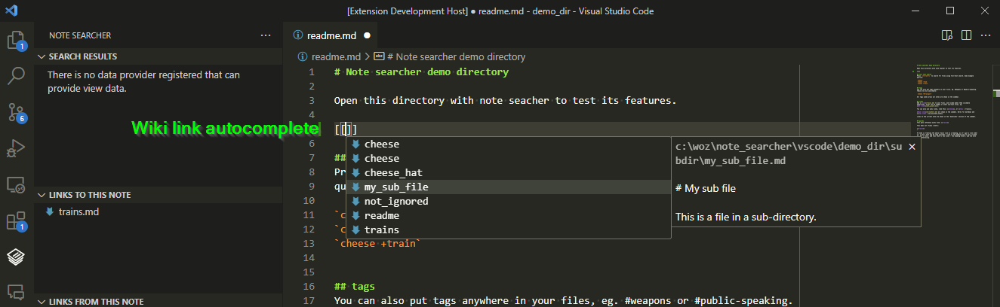

# Note Searcher

Helps manage your knowledge base of text files, such as a zettelkasten. Works
with a flat or hierarchical file structure. Very similar to [Foam](https://foambubble.github.io/foam/)!
Foam is much more popular and well supported. Why does this extension exist?
Foam wasn't around when I started this extension, and has some key differences
that keep me using this extension.

Key differences to Foam:
+ includes full text search
+ wiki link aliases are backwards: [[like this | some_filename]]
+ no graph visualisation (I've never found this to be useful)


## Feature summary

- Full text search
- Quick-create notes
- Link autocompletion
- Copy markdown/wiki link to note from search results, file explorer
- Copy markdown/wiki link to note from editor tab
- Wiki link highlighting and navigation
- Update wiki links when files are renamed
- Shows links to and from current note in sidebar
- Shows dead links in sidebar


## How to use this extension

Install and enable it in your workspace. I don't recommend enabling everywhere,
as it will try to index every folder, which can take a long time if there are a
lot of files.


### Full text search


Full text search searches all .md, .txt and .log files in the currently open
workspace.

You can search for files by pressing `ctrl+alt+s`. Some example queries:

```
apple banana +carrot          # file contains the word carrot, and possibly apple or banana
apple banana -carrot          # file does not contain carrot, but either apple and/or banana
apple banana path:/some/path  # apple or banana, only in files containing /some/path
apple banana -path:.log       # apple or banana, not in log files
```


### Creating notes


Press `ctrl+alt+n` to create a new note in the same directory as the currently
open note.


### Linking notes



You can add links to other notes using wiki-style links, like [[this]] or with
a label first: [[some description | filename]]. If multiple files with the same
name exist, vscode will prompt for which note to navigate to.

Markdown links are also supported, eg. `[](path/relative/to/file)`.

You can copy a markdown or wiki link to a search result by right-clicking on the
search result. You can also copy this link from the explorer and editor tabs.

Links within code blocks are ignored:

```sh
#like this one: [[yo]]
```


### Find dead links

Links to files that can't be found are shown in the dead links section of the
sidebar.


## Reporting bugs/issues/feature requests

If you find any problems, have any questions, or have any requests for features,
please create an issue at https://github.com/uozuAho/note_searcher/issues
