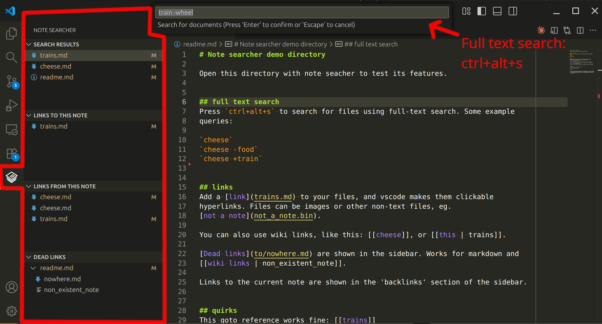
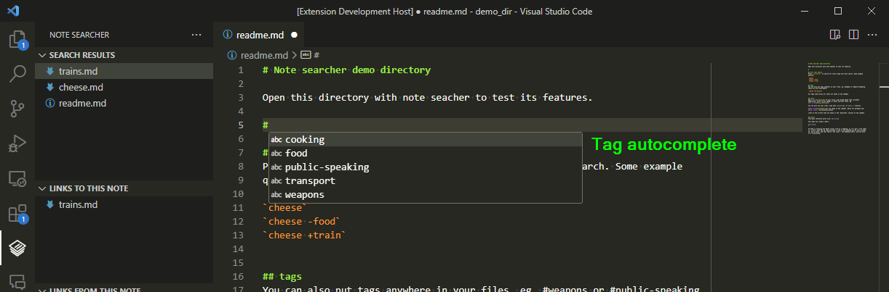
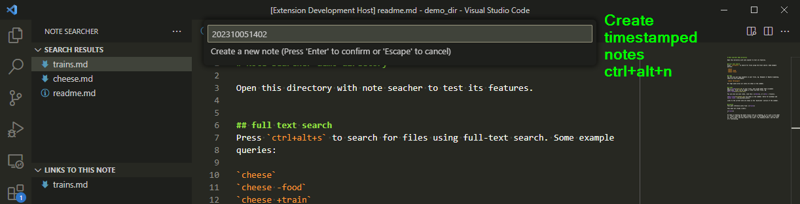

# Note Searcher

Helps manage your knowledge base of text files, such as a zettelkasten. Works
with a flat or hierarchical file structure. Very similar to [Foam](https://foambubble.github.io/foam/)!
Foam is much more popular and well supported. Why does this extension exist?
Foam wasn't around when I started this extension, and has some key differences
that keep me using this extension.

Key differences to Foam:
+ includes full text search
+ wiki link aliases are backwards: [[like this | some_file.md]]

Some nice Foam features not in this extension:
- link autocomplete
- update links on file rename
- graph visualisation (I've never found this to be useful)


## Feature summary

- Full text search
- Quick-create notes
- Tag autocompletion
- Copy markdown/wiki link to note from search results, file explorer
- Copy markdown/wiki link to note from editor tab
- Wiki link highlighting and navigation
- Shows links to and from current note in sidebar
- Shows dead links in sidebar
- Shows all tags in sidebar


## How to use this extension

Install and enable it in your workspace. I don't recommend enabling everywhere,
as it will try to index every folder, which can take a long time if there are a
lot of files.


### Full text search



This extension indexes all .md, .txt and .log files in the currently open
folder.

You can search for files by pressing `ctrl+alt+s`. Some example queries:

```
apple banana +carrot  # file contains the word carrot, and possibly apple or banana
apple banana -carrot  # file does not contain carrot, but either apple and/or banana
apple banana #food    # file contains apple, banana, and/or the tag #food
```


### Tags



Any word starting with a '#' character is considered a tag, allowing for
tag-based searching. #hyphenated-tags are supported.

Typing '#' will suggest auto-complete options based on existing tags.

All existing tags are shown in the sidebar, as per the screenshot.


### Creating notes



Press `ctrl+alt+n` to create a new note in the same directory as the currently
open note.


### Linking notes

With VS Code, you can add links to local files using markdown
syntax. These become hyperlinks to your local files. Examples:

- `[](path/relative/to/file)`

You can copy a markdown or wiki link to a search result by right-clicking on the
search result. You can also copy this link from the explorer and editor tabs.

Wiki-style links are also supported. The link must be a filename with no
extension, with an optional description before a pipe separator. Eg. [[note]] or
[[a note with a description | and_filename]]. If multiple notes with the same
name exist, vscode will prompt for which note to navigate to.

Links within code blocks are ignored:

```sh
#like this one: [[yo]]
```


### Links to and from current note

Links to and from  the currently open note are shown in the sidebar.


### Find dead links

Links to files that can't be found are shown in the dead links section of the
sidebar.


## Reporting bugs/issues/feature requests

If you find any problems, have any questions, or have any requests for features,
please create an issue at https://github.com/uozuAho/note_searcher/issues
